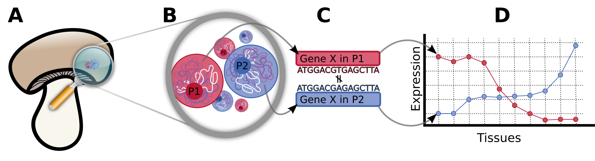

# Homokaryon expression
The discovery and analysis of homokaryon specific expression.


The tool identifies karyollele pairs between TWO nuclear types (in a dikaryon), and then discovers unique markers that distinguish them from each other, and the rest of the genome.
These markers can be used to deconvolve the expression of a karyollele pair in the two nuclear types in a bulk RNA-Seq sample.

## Installation

To install this tool, download and install the dependencies, and clone this repository

```bash
git clone https://github.com/thiesgehrmann/Homokaryon-Expression.git
```

### Dependencies
  This tool delegates all package requirements to conda, and makes use of Snakemake as an implementation framework.
  For a list of the dependencies required, please see [the conda configuration file](pipeline_components/snakemake.yaml).
  * [Conda](https://conda.io/docs/)
  * [Snakemake](https://snakemake.readthedocs.io/en/stable/)

  The tool also makes use of an additional toolkit, called [Ara](https://github.com/AbeelLab/ara/), but this is automatically downloaded and build by the pipeline.

## Example dataset
  As an example dataset, I provided the sequence of chromosome 13 from P1 and P2 of *Agaricus bisporus*, and the genes described on that genome in the folder `example_data`.
  You can generate and run the example dataset with:

### Running the example dataset

```bash
git clone https://github.com/thiesgehrmann/Homokaryon-Expression.git
cd Homokaryon-Expression
snakemake --use-conda --snakefile example_data/generateExample.Snakefile --configfile --cores 4 example.json genBam # Generate the sequencing data
snakemake --use-conda --configfile example.json --cores 4 geneRatios
```

### Output
This produces the output files

 * **example_output/kse/grr.tsv**: Gene Read Ratios
 * **example_output/kse/crr.tsv**: Chromosome Read Ratios
 * **example_output/kse/nrr.tsv**: Nuclear Read Ratios
 * **example_output/kse/cgr.tsv**: Chromosome Gene Ratios
 * **example_output/kse/ngr.tsv**: Nuclear Gene Ratios

## Your own data

You must provide the following information to examine homokaryon specific expression in a dikaryon:

 * Homokaryon 1:
   * Genome file (FASTA format)
   * GFF file ( [GFF3](http://gmod.org/wiki/GFF3) format, with 'mRNA' transcript type identifiers)
 * Homokaryon 2:
   * Genome file (FASTA format)
   * GFF file (GFF3 format)
 * Samples:
   * [Unaligned BAM files](https://gatkforums.broadinstitute.org/gatk/discussion/6484/how-to-generate-an-unmapped-bam-from-fastq-or-aligned-bam]) (sorted by read name)
   * Replicates (untested without replicates)

Please see the configuration file example.json for an overview of how to configure the pipeline.


## Citation

If you use this tool in your work, please cite

[Nucleus Specific Expression In The Multinucleated Mushroom-Forming Fungus Agaricus bisporus Reveals Different Nuclear Regulatory Programs](http://www.biorxiv.org/content/early/2017/07/04/141689),

Thies Gehrmann, Jordi F. Pelkmans, Robin A. Ohm, Aurin M. Vos, Anton S. M. Sonnenberg, Johan J. P. Baars, Han A. B. Wosten, Marcel J. T. Reinders, Thomas Abeel,

bioRxiv 141689; doi: https://doi.org/10.1101/141689

