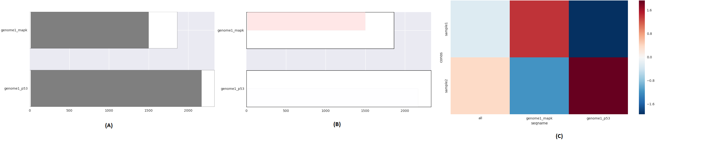

# Homokaryon expression
The discovery and analysis of homokaryon specific expression

## Usage

### Dependencies
  This tool does require some other packages. This should be all of them:
  * Ibidas (https://github.com/thiesgehrmann/ara)
  * Numpy
  * scipy
  * seaborn
  * Matplotlib
  * Pandas
  * ara (https://github.com/thiesgehrmann/ara)
  * R
  * DESeq

### Configuration
  In the /pipeline.sh/ file, change the variable ARALOC, to match your own setup.

### Execution of pipeline
   ./pipeline.sh \<genome1.fasta,genome2.fasta\> \<genome1.gff,genome2.gff\> \<output_dir\> \<data_file\> \<paired\>

  * genome1.fasta: The multifasta genome sequence of genome 1
  * genome2.fasta: The multifasta genome sequence of genome 2
  * genome1.gff:   The GFF3 file for genome 1
  * genome2.gff:   The GFF3 file for genome 2
  * output_dir:    The output location
  * data_file:     A description file describining each sample
  * paired:        [Y|N] Is it paired end data Yes or No?
 

## Example dataset
  As an example dataset, I artificially created two genomes, and FASTQ data for two samples, in duplo.
  I took created a fake genome *genome1* that consists only of two chromosomes.
  *genome2* is a duplicate of this genome where all TAA triplets were replaced TAG triples.
  Artificial read data, not at all reflective of real RNA-Seq data were generated by the script [example_data/gen_example_samples.sh](example_data/gen_example_samples.sh).

  By running ./run_example.sh, the example dataset will be run. Output will be produced in output_example.
  Execution time for the example is approximately 90 seconds.

### Example Input
  As an example, I will describe the input files for the example

  * [example_data/dataset.tsv](example_data/dataset.tsv): A tab separated file containing a description of the samples and their replicates and names.
  * [example_data/genome1.gff3](example_data/genome1.gff3): A gff file in gff3 format descricribing the genes on the first genome
  * [example_data/genome2.gff3](example_data/genome2.gff3)
  * [example_data/genome1.fasta](example_data/genome1.fasta): A multifasta file of the genome for genome1
  * [example_data/genome2.fasta](example_data/genome2.fasta)
  * [example_data/gen_example_samples.sh](example_data/gen_example_samples.sh): A script to generate the bam files used in the example. If you want to play around with diff ex etc. Just change the settings in here
  * [example_data/sample1_1.fastq](example_data/sample1_1.fastq): The fastq files generated by (gen_example_samples.sh)
  * [example_data/sample1_2.fastq](example_data/sample1_2.fastq)
  * [example_data/sample2_1.fastq](example_data/sample2_1.fastq)
  * [example_data/sample2_2.fastq](example_data/sample2_2.fastq)
  * [example_data/sample1_1.bam](example_data/sample1_1.bam): The bam files made from the fastq files above.
  * [example_data/sample1_2.bam](example_data/sample1_2.bam)
  * [example_data/sample2_1.bam](example_data/sample2_1.bam)
  * [example_data/sample2_2.bam](example_data/sample2_2.bam)

### Example Output
  
  The script produces quite a lot of output files.
  In the example, most are probably not particularly interesting, but if your dataset contains more than 2 genes, it will be.
  Here I describe some of the output files, ordered by creation time.
  * *Mapping stage*
    * mapping.tsv: The list of all mapped gene identifiers
    * mapping_0.fasta: The list of mapped genes in first organism organism, where the nth gene in the file is mapped to the nth gene in the mapping_1.fasta file.
    * mapping_1.fasta: The list of mapped genes in the second organism.
  * *Marker discovery*
    * UniqueMarkers_0.tsv: A tab delimited file containing all markers for the first organism.
    * UniqueMarkers_0.fasta: Same as above, only in fasta format
    * UniqueMarkers_1.tsv
    * UniqueMarkers_1.fasta
    * UniqueMarkers_all.fasta: The combination of all markers found, in fasta format.
  * *Marker counting*
    * MarkerCounts_sample1_1.tsv.ara: The counts for each marker for the first sample.
    * MarkerCounts_sample1_2.tsv.ara
    * MarkerCounts_sample2_1.tsv.ara
    * MarkerCounts_sample2_2.tsv.ara
  * *Analysis*
    * CG_read_depth.png: A plot showing the read depth for each marker vs. the CG content of each marker.
    * CG_read_depth.svg
    * DESEQ_genes.input.tsv: The input for DESEQ with counts for each gene
    * DESEQ_chrom.input.tsv: The input for DESEQ with counts for each chromosome (not used in manuscript)
    * DESEQ_tissue.input.tsv: The input for DESEQ with counts for each nuclear type (not used in manuscript)
    * DESEQ_genes.condlibratios.tsv: (DESEQ) The size factors per sample based on genes
    * DESEQ_genes.MAplot.sample1.pdf: (DESEQ) An MA plot for each sample 
    * DESEQ_genes.MAplot.sample2.pdf:
    * DESEQ_genes.output.tsv: For each sample, the number of genes upregulated in organism 1, organism 2, or not differentially expressed at all
    * DESEQ_genes.tests.tsv: The results of the DESEQ tests
    * DESEQ_chrom.condlibratios.tsv: The same as above at the chromosome level
    * DESEQ_chrom.MAplot.sample1.pdf
    * DESEQ_chrom.MAplot.sample2.pdf
    * DESEQ_chrom.output.tsv
    * DESEQ_chrom.tests.tsv
    * DESEQ_tissue.condlibratios.tsv: The same as above at the nuclear type level
    * DESEQ_tissue.MAplot.tissue.pdf
    * DESEQ_tissue.output.tsv
    * DESEQ_tissue.tests.tsv
    * diff_reg_count.tsv: The number of differentially expression genes per sample
    * diff_regulated.tsv: The differentially expressed genes
    * diff_regulated_ids.tsv: The identifiers of differentially expressed genes
    * gene_ratio_stats.tsv: Gene read ratio (GRR) statistics
    * genes.differentiable.png: A graphical visualization of the genes that are differntiable by markers
    * genes.gene_ratio_chromosome.all.png: A graphical visualization, as above, where the GRR is shown on top of the genes, averaged across all samples.
    * genes.gene_ratio_chromosome.all.svg
    * genes.gene_ratio_chromosome.sample1.png: A graphical visualization of the differntially expressed genes in sample 1
    * genes.gene_ratio_chromosome.sample1.svg
    * genes.gene_ratio_chromosome.sample2.png
    * genes.gene_ratio_chromosome.sample2.svg
    * genes.gene_ratio_chromosome.abs.all.png: Same as above, except that the threshold for expression is set at a ratio of 1.
    * genes.gene_ratio_chromosome.abs.all.svg
    * genes.gene_ratio_chromosome.abs.sample1.png
    * genes.gene_ratio_chromosome.abs.sample1.svg
    * genes.gene_ratio_chromosome.abs.sample2.png
    * genes.gene_ratio_chromosome.abs.sample2.svg
    * chr.gene_ratio.svg: Chromosome Gene Ratio (CGR) for each chromosome and sample
    * chr.gene_ratio.png
    * chr.read_ratio.svg: Chromosome Read Ratio (CRR) for each chromosome and sample
    * chr.read_ratio.png
    * chr.gene_ratio_log.svg: CGR with log scales
    * chr.gene_ratio_log.png
    * chr.read_ratio_log.svg: CRR with log scales
    * chr.read_ratio_log.png

## Real data

  Additionally, if you are willing dow download your own data, there are two configuration files provided for two publicly available datasets:
  * agabi_compost_nodup.tsv: https://www.ncbi.nlm.nih.gov/bioproject/309475
  * agabi_compost_data.tsv: https://www.ncbi.nlm.nih.gov/bioproject/PRJNA275107

